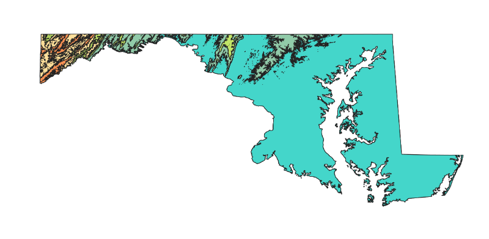
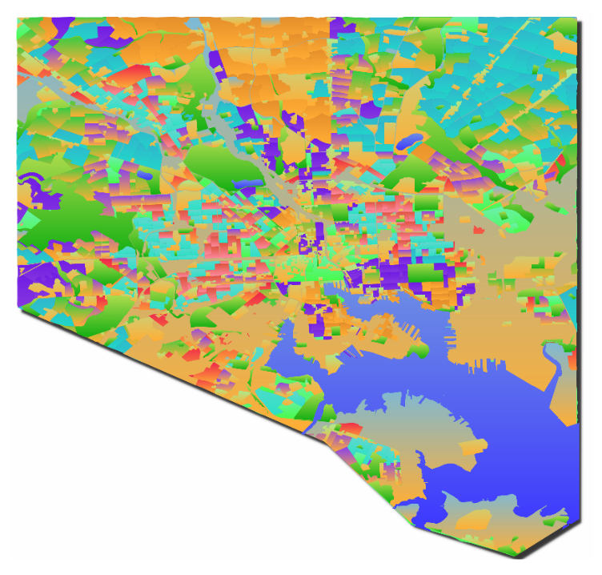

# Nathan Jones Portfolio

## Project 1


  My first project in GES 486 was the creation of an elevation map for Baltimore. I had wished to create a flood vulnerability index through this but ultimately I couldn't make that happen. However, I consider this elevation map one of the most aesthetically pleasing maps I have ever created. 

  I made this map starting out from a DEM of Maryland that I clipped to Baltimore. I used the Re-classify tool to reform the elevation values in terms of census blocks, and properties in the city. I utilized different transparency values and color ramps in order to allow the TIFFs to seamlessly lay on top of each other.

  This project allowed me to portray a map of Baltimore's elevation in a way I'd never tried before. The gradients going on allow for easy understanding of the relative elevations in the city, with the lowest areas to the south and east, and the highest areas to the north and west.

## Project 2


  My second project in GES 486 was a group of Black population maps for the state of maryland in 3 different years. The years I chose were 2000, 2010, and 2017. I utilized various counts of census data and estimates in order to get the data for this. A lot of time was spent in excel combing through data, cutting out information that was non-hispanic or hispanic estimates (as I wanted both), cutting away fields that were of the wrong locations, as well as making calculations of percentages or totals due to lapses in local totals in certain counties some years (2000 data especially required this.)

  I found that Maryland's Black population resides most heavily in Prince George's County and Baltimore City. In total numbers, black folks are mostly in central Maryland with much lower populations the further away you get from DC & Baltimore. In percentages, there is a pocket of black folks in Southeast Maryland, due to the presence of the HBCU UMES in Somerset County. Charles County has seen a growth in black population percentage partly due to the gentrification in DC displacing black and impoverished residents. It's effectively been growing as a cheaper alternative to Prince George's County due to it's relative closeness to DC and the Washington Metropolitan Area. 

  Montgomery, Howard, Baltimore, Anne Arundel Counties have hosted a modest and increasing Black Population. These areas largely suburban and middle class populations reflect sects of upward mobility and recent history of 'black flight'. However, Prince Georges' County hosts some of the largest and richest black communities in country, while also harboring great inequity and segregation among black communities. This has only increased over the past few decades.

  I hit quite a few roadblocks on this thing along the way but I am ultimately happy with the way this turned out. A lot of the symbology came together the day I finally submitted it, as it was bugging or refusing to appear for a long time. I was able to express the legend in a pretty solid way as well.

## Project 3




# Project 4



### Markdown

Markdown is a lightweight and easy-to-use syntax for styling your writing. It includes conventions for

```markdown
Syntax highlighted code block

# Header 1
## Header 2
### Header 3

- Bulleted
- List

1. Numbered
2. List

**Bold** and _Italic_ and `Code` text

[Link](url) and 
```

For more details see [GitHub Flavored Markdown](https://guides.github.com/features/mastering-markdown/).

### Jekyll Themes

Your Pages site will use the layout and styles from the Jekyll theme you have selected in your [repository settings](https://github.com/natejones1096/natejones1096.github.io/settings). The name of this theme is saved in the Jekyll `_config.yml` configuration file.

### Support or Contact

Having trouble with Pages? Check out our [documentation](https://help.github.com/categories/github-pages-basics/) or [contact support](https://github.com/contact) and we’ll help you sort it out.
